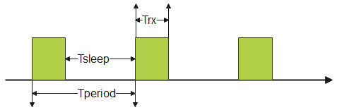

# How to optimize the current consumption of Long Preamble Duty Cycle application on FG14
## Overview
The **Flex SDK** provides the **Long Preamble Duty Cycle** example application which is widely used by lots of customers in different industry scenarios like Smart Meter, Smart Medica, etc. In most of the use cases, the product is working in duty cycle mode(more details please refer to this [KBA](https://community.silabs.com/s/article/low-duty-cycle-mode?language=en_US)) with DSSS long-range PHY to save power energy and in the meanwhile to reach a long communication distance. As the device is always powered by a battery, we expect to reduce the average power consumption of the device as much as possible.

This article introduces a way to optimize the average power consumption of the Long Preamble Duty Cycle example application with the DSSS long-range PHY and provides a step-by-step guide to verify the solution on the BRD4261A radio board. The test result demonstrates the average power consumption decreases a lot after applying the optimized radio configuration.
## Hardware Required
  - One Radio Board: BRD4261A(EFR32FG14P233F256GM48)
  - Signal Generator: [E4432B](https://github.com/silabs-JimL/LR_WaveFormGenerator)
  - Spectrum Analyzer: MS2692A 
  - Power Analyzer: N6705C  
## Software Required  
  - Flex SDK Version: V3.2.1
  - IDE: Simplicity Studio V5
  - Example: Long Preamble Duty Cycle
  - Radio Configurations: Long Range Profile with 490M 9.6 kbps OQPSK DSSS

## The theoretical analysis of the power consumption
The formula of average current on one duty cycle is as follows.  
  

***Iavg = (Trx * Irx + Tsleep * Islepp) / Tperoid*** 
- ***Iavg*** - average current in one duty cycle
- ***Trx*** - the time of Rx state
- ***Irx*** - Rx current
- ***Tsleep*** - radio sleep time
- ***Isleep*** - sleep current
- ***Tperiod*** - the period time of LDC  

From the above analysis, we probably have two methods to decrease the average power consumption: one is to decrease the sleep current, another is to reduce the Rx on time.

## How to create the Long Preamble Duty Cycle example application in Simplicity Studio  
1. Start Simplicity Studio V5, go to the **Simplicity IDE** perspective.
2. Click **Project**->**New**->**Silicon Labs Wizard...**
3.  Choose the board or device(we choose BRD4261A here), select the SDK version V3.2.1 and IAR or GNU ARM Toolchain, and then click the **NEXT**.
4.  In the left **Technology Type** tab, choose the **Propriety**.
5.   In the right example list, choose **Flex(RAIL)-Long Preamble Duty Cycle** example, and then click **NEXT**. You can modify the Project name and then click **FINISH**.
6.  Double click the **long_preamble_duty_cycle.slcp** file in the Project Explorer and open it, then click the **CONFIGURATION TOOLS** and click the **open** the Radio Configurator.
7. In the **General Settings**, choose the **Long Range Profile** in the Select radio profile area, and choose the **434MHz 9.6 kbps OQPSK DSSS SF8** in the Select radio PHY area.
8. Enable the **Customized** button, set the **Base Channel Frequency** to **490MHz** in the **Operational Frequency** area. 
9. In the **Other settings** area, set the **Long Range Mode** to **LR_9p6k**.
10. Below is the detail of the Radio Configuration for your reference.  
  

11. Finally, type **Ctrl+S** to save the radio configurations. The relevant codes will be generated automatically in the project. 

## Remove the unused peripherals to optimize the EM2 current 
12.  **Uninstall LED driver**  
     - Go to the **"long_preamble_duty_cycle.slcp"** file, click the **SOFTWARE COMPONENTS**, and search **LED** in software components. You can see the **Simple LED** component under Driver, click the **Uninstall** and delete the **led0** and **led1** instance, click **Done**.
      
13. **Uninstall Button driver**  
    -  Search **Button**, click the **Simple Button** component, and then click **Uninstall**, check the **btn0** and click **Done** in the pop-up dialog. 
14. **Uninstall PTI component**  
    -  Search **RAIL Utility**, click the **RAIL Utility, Recommended** component, and then click **Uninstall**, the **RAIL Utility, PTI** component will be uninstalled. 
15. **Uninstall Graphics Library**  
    -  Search **Graphics**, click the **GLIB Graphics Library** component and then click **Uninstall**.
16. **Disable unused GPIO**
    -  Go to the **"CONFIGURATION TOOLS"** tab and click **open** on the right of the **Pin Tool**, configure the unused GPIO mode to **None**, below is the configuration for your reference:  
          

17. **Disable Vcom**  
    -  Search **Board Control** in software components, and click the **Configure** button. In the **General** area, disable the **Enable Virtual COM UART** button.
18. **Remove the LED control function**
    -  Open the ***app_init.c*** file and comment the ***#include "sl_simple_led_instances.h"*** and comment the ***sl_led_turn_off(&sl_led_led0)*** and ***sl_led_turn_off(&sl_led_led1)*** in  function ***RAIL_Handle_t app_init(void)***.
    -  Open the ***app_process.c*** file and comment the ***#include "sl_simple_led_instances.h"*** in the included header file area, and comment the ***sl_led_toggle(&sl_led_led1)*** and ***sl_led_toggle(&sl_led_led0)*** in  function ***void app_process_action(RAIL_Handle_t rail_handle)***.

19. **Add TCXO related functions**   
    -  **Note**: If your board do not use TCXO, please ignore this step. We use the 4261A board in here.
    -  Open the ***sl_power_manager_hal_s0_s1.c*** in the project folder: ***gecko_sdk_3.2.2->platform->service->power_manager->src***.
    -  Modify the ***void sli_power_manager_handle_pre_deepsleep_operations(void)*** and ***void sli_power_manager_restore_high_freq_accuracy_clk(void)*** functions as below code snippets. Note: you will see a pop-up warning box when modifying the code, click **Make a Copy** to copy the this file from SDK library to the project workspace.  
        

       ```C
        #include "em_device.h"
        #if (defined(_SILICON_LABS_32B_SERIES_0) || defined(_SILICON_LABS_32B_SERIES_1))
        #include "em_emu.h"
        #include "em_cmu.h"
        #include "em_assert.h"
        #include "sl_power_manager_config.h"
        #include "sl_power_manager.h"
        #include "sli_power_manager_private.h"
        #include "sl_sleeptimer.h"
        #include "sli_sleeptimer.h"
        #include "sl_board_control.h" // add this head file  
        #include <stdbool.h>  


        /***************************************************************************//**
        * Handle pre-deepsleep operations if any are necessary, like manually disabling
        * oscillators, change clock settings, etc.
        ******************************************************************************/
        void sli_power_manager_handle_pre_deepsleep_operations(void)
          {
            if (is_hf_x_oscillator_used) {
                CMU_OscillatorEnable(cmuOsc_HFRCO, true, true);
                CMU_HFRCOBandSet(cmuHFRCOFreq_38M0Hz);
                CMU_ClockSelectSet(cmuClock_HF, cmuSelect_HFRCO);
                CMU_OscillatorEnable(cmuOsc_HFXO, false, false);
                sl_board_disable_oscillator(SL_BOARD_OSCILLATOR_TCXO);
            }
          }           

    
        /***************************************************************************//**
        * Handle post-sleep operations if any are necessary, like manually enabling
        * oscillators, change clock settings, etc.
        ******************************************************************************/
        void sli_power_manager_restore_high_freq_accuracy_clk(void)
        {
          if (is_hf_x_oscillator_used) {
              sl_board_enable_oscillator(SL_BOARD_OSCILLATOR_TCXO);
          }
        }   
        ```

    
    -  Add the ***sli_power_manager_private.h*** path to compiler. **Right click the project**->**properities**->**C/C++ build**->**setting**->**Tool setting**->**GNU ARM compiler**->**includes**, add the ***"${StudioSdkPath}/platform/service/power_manager/src"*** to path as the following figure.  
        

20. **Configure the Duty Cycle**
    - Preamble detect need at least 40 bits. The formula is as follows.  
***Trx = 40 / 9.6 = 4.167 ms***
    - Open ***the sl_duty_cycle_config.h*** in the config folder, and modify the macro **DUTY_CYCLE_ON_TIME** to 4167.  
      ```C
      #define DUTY_CYCLE_ON_TIME      (4167)
      ```   
21. **Enable EM2 mode and disable button**  
    - Open the ***sl_duty_cycle_config.h*** file in the config folder, enable EM2 mode and disable button as following.
    ```c
    #define DUTY_CYCLE_USE_LCD_BUTTON      0
    #define DUTY_CYCLE_ALLOW_EM2           1
    ```
22. **Build the project and flash the firmware**
    - Click the hammer icon to build the project.
    - After compiling is completed, the .s37 binary file is located at **binaries** folder, right-click the .s37 binary and choose **Flash to device...**->**choose the target device**->**OK**.   

## Measure EM2 current consumption
  

 We use the power analyzer N6705C to measure the EM2 current consumption and get the average current consumption is about 1.94 uA. For more info about how to measure the sleep current please refer to [AN969](https://www.silabs.com/documents/public/application-notes/an969-measuring-power-consumption.pdf).

According to the [EFR32FG14 datasheet](https://www.silabs.com/documents/public/data-sheets/efr32fg14-datasheet.pdf), the above EM2 current consumption is close to the value mentioned in the datasheet. There still several peripherals are in use so the test result is expected. 

## Apply the optimized Radio Configuration for the DSSS long-range PHY
Silicon Labs has provided an optimized Long Range PHY with 490M 9.6 kbps OQPSK DSSS, the purpose is to reduce the average consumption of the Long Preamble Duty Cycle application and meanwhile maintain the sensitivity performance will not be decreased largely.
Below is the guide to applying the optimized radio configuration to the Long Preamble Duty Cycle example application.
### Modify the timing of preamble detection 
-  Add the below macro to the ***sl_duty_cycle_config.h*** file.
    ```C
    #define DUTY_CYCLE_PERIOD        (1500000)
    #define DUTY_CYCLE_OFF_TIME      (DUTY_CYCLE_PERIOD - DUTY_CYCLE_ON_TIME)
    ```
-  Add the below macro to the ***app_init.c*** file.
    ```C
    // -----------------------------------------------------------------------------
    //                              Macros and Typedefs
    // -----------------------------------------------------------------------------
    #define DUTY_CYCLY_SYNC_WORDS_TIME  1670
    #define DUTY_CYCLY_MARGIN_TIME      1000
    #define DUTY_CYCLY_SYNC_TIMEOUT     (DUTY_CYCLY_SYNC_WORDS_TIME + DUTY_CYCLE_PERIOD + DUTY_CYCLE_ON_TIME + DUTY_CYCLY_MARGIN_TIME)
    ```
-  Add the define of the **duty_cycle_multi_mode_config** and configure the **duty_cycle_config** in the ***app_init.c*** file as following:
    ```C
    volatile RAIL_RxChannelHoppingConfigMultiMode_t duty_cycle_multi_mode_config = {
        .timingSense = 1600,
        .preambleSense = 2200,
        .syncDetect = DUTY_CYCLY_SYNC_TIMEOUT,
        .timingReSense = 1600,
        .status = 0,
    }; 
    /// Config for the correct timing of the dutycycle API
    RAIL_RxDutyCycleConfig_t duty_cycle_config = {
      .delay = ((uint32_t) DUTY_CYCLE_OFF_TIME),
      .delayMode = RAIL_RX_CHANNEL_HOPPING_DELAY_MODE_STATIC,
      .mode = RAIL_RX_CHANNEL_HOPPING_MODE_MULTI_SENSE,
      .parameter =  (uint32_t) (void *) &duty_cycle_multi_mode_config
    //  .parameter = ((uint32_t) DUTY_CYCLE_ON_TIME)
    };
    ```
-  Open the ***sl_duty_utilicy.c*** file in the folder ***gecko_sdk_3.2.2->app->flex->component->rail->sl_duty_cycle_core*** and modify the **calculate_preamble_bit_length_from_time** function as following. Please choose **Make a Copy** when you modify the file.  
    ```C
    uint16_t calculate_preamble_bit_length_from_time(const uint32_t bit_rate, RAIL_RxDutyCycleConfig_t * duty_cycle_config)
    {
      float on_time = 0;
      float off_time = 0;
      float preamble_time = 0;
      float preamle_bit_length = 0;

      on_time = DUTY_CYCLE_ON_TIME;
      off_time = duty_cycle_config->delay;
      preamble_time = ((float)(PREAMBLE_PATTERN_LENGTH * PREAMBLE_PATTERN * PREAMBLE_OVERSAMPLING) * U_SEC) / bit_rate;

      app_assert(preamble_time < on_time, "Please modify the on time according to the bitrate!\n");

      while (1) {
        preamble_time = (off_time + (2 * on_time)) / 1000000;
        preamle_bit_length = (preamble_time * bit_rate);
        if (preamle_bit_length <= 50000) {
          break;
        }
        off_time = off_time - on_time;
      }

      if (((uint32_t)off_time) != DUTY_CYCLE_OFF_TIME) {
        app_log_warning("Duty Cycle Off time was changed to ensure stable working\n");
      }

      return preamle_bit_length;
    }
    ```
### Override the Radio Configuration
-  Please download the ***rail_config.c*** and ***rail_config.h*** file from the [Optimized 9p6k radio configuation](radio_configuations/optimized_9p6k_configuation), and replace the original files located in the **Autogen** folder.  
   
-  Rebuild the project, and flash the firmware to the device.  

**Note**: Those two files will be overwritten if you change anythings in radio generator.  

## Test Result
### Power Consumption


The below table is the comparison of power consumption between the sample project with and without the optimization.
|   Project   |Original Project| Optimized Project| 
|:----:| :-----------:| :----------------:| 
|**Average Current**| 40.67 uA| 19.04 uA |  

**Conclusion:**   
The average current consumption of the sample project with optimized radio configuration is **19.04 uA**, which is much better than the average current consumption of the original sample project. From the table, the average current consumption reduces **53%**, which is a very huge improvement. 
### Sensitivity
We use the [LR_Waveform_Generator](https://github.com/silabs-JimL/LR_WaveFormGenerator) and E4432B signal generator to measure the conducted sensitivity. Below is the test result, we can see the sensitivity of the optimized project is **-118.4 dBm**. 
|  Output Power    |Tx Packets| Rx Packets| 
|:----:| :-----------:| :----------------:| 
|-119.2 dBm| 1000 | 974 |
|-118.8 dBm| 1000 | 982 |
|-118.6 dBm| 1000 | 989 |
|-118.5 dBm| 1000 | 987 | 
|**-118.4 dBm**| **1000** | **991** |
|-118.3 dBm| 1000 | 994 |

The sensitivity of the original long preamble duty cycle project is **-119.2 dBm**.  
|  Output Power    |Tx Packets| Rx Packets|
|:----:| :-----------:| :----------------:| 
|-119.8 dBm| 1000 | 981 |
|-119.6 dBm| 1000 | 987 |
|-119.4 dBm| 1000 | 984 |
|**-119.2 dBm**| **1000** | **993** | 
|-119.1 dBm| 1000 | 995 |
   
The below table includes the comparison of sensitivity between the sample project and the optimized project.     

|   Project   |Sample Project| Optimized Project| 
|:----:| :-----------:| :----------------| 
|**Sensitivity**| -119.2 dBm| -118.4 dBm|    

  **Conclusion:**   
  The sensitivity of the sample project with optimized radio configuration reduces about **0.8 dBm**, which is insignificant and can be accepted by customers in order to get better power consumption.  
## FAQ
### Can we use the approach for other data rate, for instance, 19.2kbps or 1.2kbps?
We only provide the optimized radio configuration for 9.6kbps on EFR32FG14 in this project, which can be covered for most of the use cases that power consumption is sensitive. Please feel free to contact the Silicon Labs FAE or Sales team if you have any other requirements.
### How to implement it on the board without TCXO ?
You can just ignore the steps of the modification for TXCO.
## References
-  [KBA: Understanding DSSS Encoding and Decoding on EFR32 Devices](https://community.silabs.com/s/article/understanding-dsss-encoding-and-decoding-on-efr32-devices?language=en_US)  
-  [KBA: Low duty cycle mode](https://community.silabs.com/s/article/low-duty-cycle-mode?language=en_US)  
-  [UG460: EFR32 Series 1 Long Range Configuration Reference](https://www.silabs.com/documents/public/user-guides/ug460-efr32-series-1-long-range-configuration.pdf)  
-  [Datasheet: EFR32FG14 Flex Gecko Proprietary Protocol SoC Family Data Sheet](https://www.silabs.com/documents/public/data-sheets/efr32fg14-datasheet.pdf)
-  [AN969: Measuring Power Consumption on wireless Gecko Devices](https://www.silabs.com/documents/public/application-notes/an969-measuring-power-consumption.pdf) 
-  [Long Range Waveform Generator](https://github.com/silabs-JimL/LR_WaveFormGenerator) 


